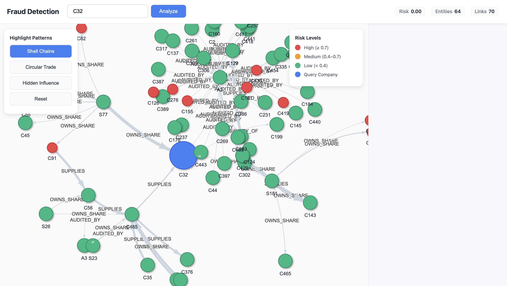
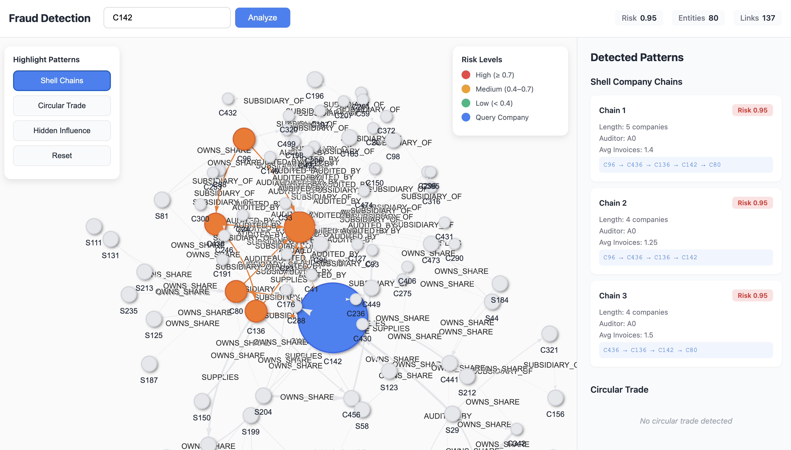
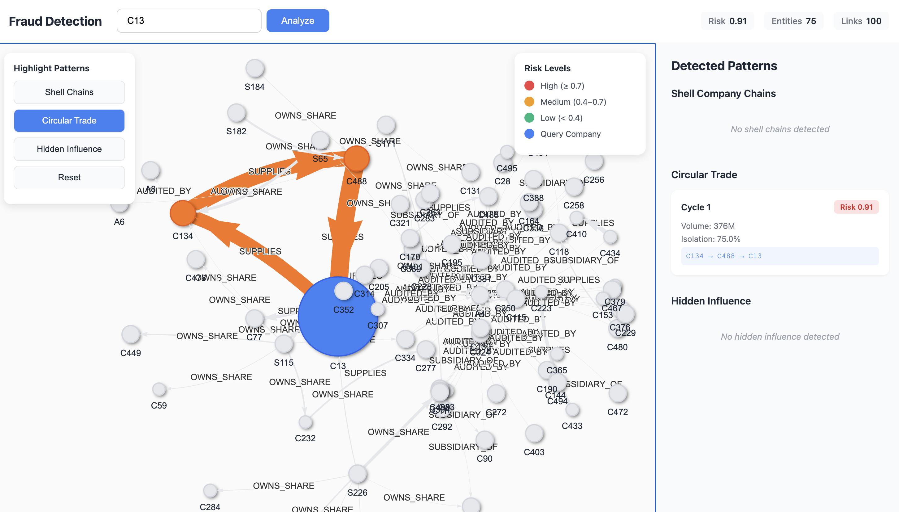
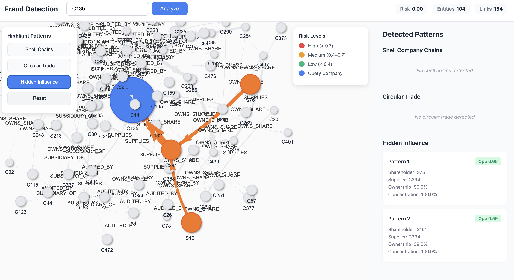

# 🕵️ Fraud Detection System
### Graph-Based Pattern Analysis using Neo4j & FastAPI

[](https://www.python.org/)
[](https://neo4j.com/)
[](https://fastapi.tiangolo.com/)
[](https://jupyter.org/)

An advanced fraud detection system that leverages graph algorithms to identify suspicious patterns in financial networks. This project uses Neo4j graph database, FastAPI backend, and an interactive web interface to detect three types of fraud patterns: Shell Company Chains, Circular Trade, and Hidden Influence.

---

## 📖 Table of Contents

- [Overview](#-overview)
- [Features](#-features)
- [System Architecture](#-system-architecture)
- [Screenshots](#-screenshots)
- [Installation](#-installation)
- [Project Structure](#-project-structure)
- [Usage Guide](#-usage-guide)
  - [Part 1: Data Generation](#part-1-data-generation-notebooks)
  - [Part 2: Data Ingestion](#part-2-data-ingestion-to-neo4j)
  - [Part 3: Fraud Pattern Detection](#part-3-fraud-pattern-detection-complete-network)
  - [Part 4: Fraud Detection API](#part-4-fraud-detection-api--ui)
- [Fraud Patterns Explained](#-fraud-patterns-explained)
- [API Reference](#-api-reference)
- [Technologies Used](#-technologies-used)
- [Contributing](#-contributing)
- [License](#-license)

---

## 🎯 Overview

This fraud detection system analyzes financial networks to identify three critical fraud patterns:

1. **🔗 Shell Company Chains**: Detects suspicious subsidiary chains with shared high-risk auditors
2. **🔄 Circular Trade**: Identifies closed loops of transactions indicating revenue inflation
3. **👤 Hidden Influence**: Discovers indirect control through concentrated supplier relationships

The system operates in two modes:
- **Batch Analysis**: Analyzes the entire network using Jupyter notebooks (500 companies, 5,849 relationships)
- **Real-time Query**: Interactive web interface for company-specific analysis

### 📊 Network Scale

| Entity Type | Count | Description |
|-------------|-------|-------------|
| **Companies** | 500 | Including 76 in legitimate groups, 25 in fraud patterns |
| **Shareholders** | 250 | Individual and institutional investors |
| **Auditors** | 10 | Including 2 HIGH-RISK auditors |
| **Invoices** | 1,500 | Transaction records |
| **Relationships** | 5,849 | All connections (ownership, supply, audit, etc.) |

### 🎯 Embedded Patterns

- **2 Shell Company Chains** (10 companies, 4-company chains)
- **3 Circular Trade Cycles** (11 companies, 3-5 company cycles)
- **2 Hidden Influence Cases** (4 companies, >25% ownership patterns)

---

## ✨ Features

### 🔍 Advanced Fraud Detection
- **Three Pattern Detection Algorithms**
  - Shell Company Detection (Graph Traversal)
  - Circular Trade Detection (Cycle Detection)  
  - Hidden Influence Detection (PageRank + Multi-hop Analysis)

### 📊 Interactive Visualization
- Real-time graph network visualization
- Color-coded risk levels (High/Medium/Low)
- Pattern highlighting with visual feedback
- Company-centric analysis view

### 🚀 High Performance
- Optimized Cypher queries for Neo4j
- Graph Data Science (GDS) algorithms
- RESTful API with FastAPI
- Responsive web interface

### 📓 Jupyter Notebooks
- Step-by-step data generation
- Automated Neo4j ingestion
- Complete network fraud analysis
- Visualization and reporting

---

## 🏗️ System Architecture

```
┌──────────────────────────────────────────────────────────────┐
│                   Fraud Detection System                      │
└──────────────────────────────────────────────────────────────┘

  📓 Jupyter Notebooks               🗄️ Neo4j Database
  ┌─────────────────┐               ┌─────────────────┐
  │ 1. Generate     │────────▶      │  Graph Database │
  │    Synthetic    │               │   - Companies   │
  │    Data         │               │   - Auditors    │
  └─────────────────┘               │   - Relations   │
                                    └─────────────────┘
  ┌─────────────────┐                       │
  │ 2. Ingest Data  │────────▶              │
  │    into Neo4j   │                       │
  └─────────────────┘                       │
                                            │
  ┌─────────────────┐                       │
  │ 3. Analyze      │◀────────▶             │
  │    Complete     │      Query            │
  │    Network      │                       │
  └─────────────────┘                       │
                                            │
                                            ▼
         ┌──────────────────────────────────────────┐
         │      fraud_detection_api/                │
         ├──────────────────────────────────────────┤
         │  FastAPI Backend (fraud_engine.py)       │
         │  • Pattern Detection Logic               │
         │  • Graph Algorithms                      │
         │  • Risk Scoring                          │
         └──────────────────────────────────────────┘
                            │
                            ▼
         ┌──────────────────────────────────────────┐
         │  Web Interface (fraud_viewer.html)       │
         │  • Company Search                        │
         │  • Interactive Graph Visualization       │
         │  • Pattern Highlighting                  │
         │  • Real-time Risk Assessment             │
         └──────────────────────────────────────────┘
```

---

## 📸 Screenshots

### Main Interface - Network Visualization

*Clean visualization with risk-level color coding*

### Shell Company Pattern Highlight

*Detailed view showing detected Shell company chains with risk scores*

### Circular Trade Pattern Highlight

*Interactive graph showing company relationships with highlighted circular trade pattern*

### Hidden Influence Risk Highlight

*Right panel showing detected patterns and risk metrics*

---

## 🚀 Installation

### Prerequisites

- **Python 3.8+**
- **Neo4j 5.x** with Graph Data Science (GDS) plugin
- **Jupyter Notebook** (for data generation/analysis)
- **Git**

### Step 1: Clone the Repository

```bash
git clone https://github.com/jhahimanshu3636/Fraud_detection.git
cd Fraud_detection
```

### Step 2: Install Python Dependencies

```bash
# Create virtual environment (recommended)
python -m venv venv
source venv/bin/activate  # On Windows: venv\Scripts\activate

# Install required packages
pip install neo4j fastapi uvicorn faker jupyter pandas numpy
```

### Step 3: Set Up Neo4j Database

#### Option A: Docker (Recommended)

```bash
docker run -d \
    --name neo4j-fraud \
    -p 7474:7474 -p 7687:7687 \
    -e NEO4J_AUTH=neo4j/password123 \
    -e NEO4J_PLUGINS='["graph-data-science"]' \
    -e NEO4J_apoc_export_file_enabled=true \
    -e NEO4J_apoc_import_file_enabled=true \
    neo4j:5-enterprise
```

#### Option B: Neo4j Desktop

1. Download [Neo4j Desktop](https://neo4j.com/download/)
2. Create a new project
3. Add database with GDS plugin
4. Start the database
5. Note the connection URI (usually `bolt://localhost:7687`)

### Step 4: Configure Connection

Update Neo4j credentials in your files:

**For Notebooks:**
```python
# In notebooks
NEO4J_URI = "bolt://localhost:7687"
NEO4J_USER = "neo4j"
NEO4J_PASSWORD = "password123"
```

**For API:**
```python
# In fraud_detection_api/fraud_engine.py
NEO4J_URI = "bolt://localhost:7687"
NEO4J_USER = "neo4j"
NEO4J_PASSWORD = "password123"
```

### Step 5: Verify Installation

```bash
# Test Neo4j connection
python -c "from neo4j import GraphDatabase; print('✓ Neo4j driver installed')"

# Start Jupyter
jupyter notebook

# Test FastAPI
cd fraud_detection_api
uvicorn app:app --reload
# Visit http://localhost:8000/docs
```

---

## 📁 Project Structure

```
Fraud_detection/
│
├── 📓 notebooks/                            # Jupyter notebooks
│   ├── synthetic_data_generation.ipynb     # Generate synthetic fraud data
│   ├── graph_ingestion.ipynb               # Load data into Neo4j
│   └── fraud_pattern_analysis.ipynb        # Analyze complete network
│
├── 📂 fraud_detection_api/                 # FastAPI application
│   ├── app.py                              # FastAPI server & endpoints
│   ├── fraud_engine.py                     # Core fraud detection logic
│   └── fraud_viewer.html                   # Interactive web interface
│
├── 📂 output_csv/                          # Generated CSV files
│   ├── subsidiary_of.csv                   # 224 relationships
│   ├── owns_share.csv                      # 1,777 relationships
│   ├── supplies.csv                        # 359 relationships
│   ├── audited_by.csv                      # 500 relationships
│   ├── issues_to.csv                       # 1,500 relationships
│   └── pays.csv                            # 1,490 relationships
│
├── 📂 docs/                                # Documentation
│   ├── images/                             # Screenshots
│   ├── API_REFERENCE.md                    # API documentation
│   └── PATTERNS.md                         # Fraud pattern details
│
├── 📄 README.md                            # This file
├── 📄 requirements.txt                     # Python dependencies
└── 📄 .gitignore                          # Git ignore rules
```

---

## 📚 Usage Guide

### Part 1: Data Generation (Notebooks)

The first notebook generates synthetic financial network data with embedded fraud patterns.

#### Running the Notebook

```bash
jupyter notebook notebooks/synthetic_data_generation.ipynb
```

#### What It Does

The notebook generates a **realistic business network** with embedded fraud patterns following these phases:

##### **📊 Phase 1: Legitimate Business Structures**
- Creates 10 legitimate corporate groups (76 companies total)
- Establishes 20 legitimate supply chains
- Generates organic business relationships

##### **🚨 Phase 2: Embedding Fraud Patterns**

**Pattern 1: Shell Company Chains** (2 patterns, 10 companies)
- Pattern 1.1: Main=C60, Chain Length=4, Auditor=A0 (HIGH-RISK)
- Pattern 1.2: Main=C123, Chain Length=4, Auditor=A1 (HIGH-RISK)

**Pattern 2: Circular Trade** (3 patterns, 11 companies)
- Pattern 2.1: 5-company cycle: C297 → C282 → C50 → C409 → C2
- Pattern 2.2: 3-company cycle: C450 → C271 → C207
- Pattern 2.3: 3-company cycle: C364 → C233 → C211

**Pattern 3: Hidden Influence** (2 patterns, 4 companies)
- Pattern 3.1: Shareholder S221 owns 38% of C232, which supplies to C269
- Pattern 3.2: Shareholder S83 owns 36% of C184, which supplies to C193

##### **📈 Phase 3: Background Noise & Additional Relationships**
- Random subsidiary relationships
- Ownership structures  
- Auditor assignments
- Additional supply relationships
- Invoice distribution across network (1,500 invoices)

**Generated Entities**:
- **500 companies** (including fraud patterns and noise)
- **250 shareholders** (individual and institutional)
- **10 auditors** with varying risk levels (2 HIGH-RISK, 8 MEDIUM/LOW)
- **1,500 invoices** with amounts and dates

**Created Relationships**:
- `SUBSIDIARY_OF`: 224 company hierarchies
- `OWNS_SHARE`: 1,777 ownership stakes (with percentage)
- `AUDITED_BY`: 500 audit relationships
- `SUPPLIES`: 359 supply chain connections (with annual volume)
- `ISSUES_TO`: 1,500 invoice issuances
- `PAYS`: 1,490 invoice payments

#### Output

```
================================================================================
📊 NETWORK STATISTICS
================================================================================
Total Companies: 500
  • Legitimate corporate groups: 76 companies
  • Shell company chains: 10 companies (2 patterns)
  • Circular trade participants: 11 companies (3 patterns)
  • Hidden influence pattern: 4 companies (2 patterns)
  • Independent/Noise: 399 companies

Invoice Activity Distribution:
  • Low activity (≤3 invoices): 406 companies
  • Medium activity (4-10): 28 companies
  • High activity (>10): 66 companies
================================================================================

CSV Files Generated in output_csv/:
✓ subsidiary_of.csv: 224 relationships
✓ owns_share.csv: 1,777 relationships
✓ supplies.csv: 359 relationships
✓ audited_by.csv: 500 relationships
✓ issues_to.csv: 1,500 relationships
✓ pays.csv: 1,490 relationships
================================================================================
✅ Total edges generated: 5,850
✅ All CSV files successfully saved
================================================================================

🎯 Pattern Detection Guide:
  1. Shell Companies: HIGH-RISK auditor + low invoice count (≤1)
  2. Circular Trade: Cycles in SUPPLIES with high volumes (>100M)
  3. Hidden Influence: >25% ownership in suppliers with >80% concentration
```

#### Embedded Fraud Patterns Summary

| Pattern Type | Count | Companies Involved | Key Characteristics |
|--------------|-------|-------------------|---------------------|
| **Shell Company Chains** | 2 chains | 10 companies | HIGH-RISK auditor + ≤1 invoice |
| **Circular Trade** | 3 cycles | 11 companies | Closed loops with >100M volume |
| **Hidden Influence** | 2 cases | 4 companies | >25% ownership + >80% supply |

---

### Part 2: Data Ingestion to Neo4j

The second notebook loads the generated data into Neo4j database.

#### Running the Notebook

```bash
jupyter notebook notebooks/graph_ingestion.ipynb
```

#### What It Does

The ingestion follows a structured 3-phase approach:

##### **PHASE 1: INGESTING NODES**

1. **Companies** (500 nodes)
   - Includes all legitimate and fraud pattern companies
   - Properties: company_id, name, industry, founded, etc.

2. **Auditors** (10 nodes)
   - 2 HIGH-RISK auditors (involved in shell company patterns)
   - 8 MEDIUM/LOW-RISK auditors
   - Properties: auditor_id, name, risk_level

3. **Shareholders** (250 nodes)
   - Individual and institutional shareholders
   - Properties: shareholder_id, name, type

4. **Invoices** (1,500 nodes)
   - Transaction records across the network
   - Properties: invoice_id, amount, date

##### **PHASE 2: CREATING RELATIONSHIPS**

1. **OWNS_SHARE** (1,777 relationships)
   - Shareholder ownership in companies
   - Property: percentage (ownership stake)

2. **AUDITED_BY** (500 relationships)
   - Every company has an auditor
   - Links companies to their audit firms

3. **ISSUES_TO** (1,500 relationships)
   - Companies issuing invoices
   - Links companies to their issued invoices

4. **PAYS** (1,490 relationships)
   - Companies paying invoices
   - Links companies to invoices they pay

5. **SUBSIDIARY_OF** (224 relationships)
   - Company hierarchies and ownership structures
   - Property: since_year (when subsidiary relationship started)

6. **SUPPLIES** (359 relationships)
   - Supply chain connections between companies
   - Property: annual_volume (transaction volume in millions)

##### **PHASE 3: CREATING INDEXES**

Performance optimization indexes are created:
```cypher
CREATE INDEX company_id_idx FOR (c:Company) ON (c.company_id);
CREATE INDEX shareholder_id_idx FOR (s:Shareholder) ON (s.shareholder_id);
CREATE INDEX auditor_id_idx FOR (a:Auditor) ON (a.auditor_id);
CREATE INDEX invoice_id_idx FOR (i:Invoice) ON (i.invoice_id);
CREATE INDEX company_risk_idx FOR (c:Company) ON (c.risk_score);
CREATE INDEX auditor_risk_idx FOR (a:Auditor) ON (a.risk_level);
```

#### Output

```
================================================================================
🚀 STARTING NEO4J DATA INGESTION
================================================================================
🗑️  Clearing existing data...
  ✅ Database cleared
================================================================================
PHASE 1: INGESTING NODES
================================================================================
🏢 Ingesting Companies...
  ✅ 500 companies ingested
👮 Ingesting Auditors...
  ✅ 10 auditors ingested
💼 Ingesting Shareholders...
  ✅ 250 shareholders ingested
📄 Ingesting Invoices...
  ✅ 1,500 invoices ingested
================================================================================
PHASE 2: CREATING RELATIONSHIPS
================================================================================
📈 Creating OWNS_SHARE relationships...
  ✅ 1,777 OWNS_SHARE relationships created
🔍 Creating AUDITED_BY relationships...
  ✅ 500 AUDITED_BY relationships created
📤 Creating ISSUES_TO relationships...
  ✅ 1,500 ISSUES_TO relationships created
💳 Creating PAYS relationships...
  ✅ 1,490 PAYS relationships created
🏢 Creating SUBSIDIARY_OF relationships...
  ✅ 224 SUBSIDIARY_OF relationships created
🚚 Creating SUPPLIES relationships...
  ✅ 359 SUPPLIES relationships created
================================================================================
PHASE 3: CREATING INDEXES
================================================================================
  ✅ CREATE INDEX company_id_idx
  ✅ CREATE INDEX shareholder_id_idx
  ✅ CREATE INDEX auditor_id_idx
  ✅ CREATE INDEX invoice_id_idx
  ✅ CREATE INDEX company_risk_idx
  ✅ CREATE INDEX auditor_risk_idx
================================================================================
📊 GRAPH SUMMARY
================================================================================
Nodes:
  • Invoice: 1,500
  • Company: 500
  • Shareholder: 250
  • Auditor: 10
  
Relationships:
  • OWNS_SHARE: 1,777
  • ISSUES_TO: 1,500
  • PAYS: 1,490
  • AUDITED_BY: 500
  • SUPPLIES: 359
  • SUBSIDIARY_OF: 223

TOTALS: 2,260 nodes | 5,849 relationships
================================================================================
🔍 VALIDATION CHECKS
================================================================================
✓ High-risk auditors: 2
✓ Companies with parent companies: 182
✓ Supply relationships: 359
✓ Sample circular supply patterns found: 6
✓ Ownership stakes >25%: 633
================================================================================
🎉 INGESTION COMPLETE!
================================================================================
Next steps:
  1. Open Neo4j Browser at http://localhost:7474
  2. Run: CALL db.schema.visualization()
  3. Start detecting fraud patterns!
```

#### Verification

Run these queries in Neo4j Browser (`http://localhost:7474`):

```cypher
// Check node counts
MATCH (c:Company) RETURN count(c) as companies;     // Should return 500
MATCH (s:Shareholder) RETURN count(s) as shareholders; // Should return 250
MATCH (a:Auditor) RETURN count(a) as auditors;     // Should return 10
MATCH (i:Invoice) RETURN count(i) as invoices;     // Should return 1,500

// Check relationship counts
MATCH ()-[r:OWNS_SHARE]->() RETURN count(r);       // Should return 1,777
MATCH ()-[r:SUPPLIES]->() RETURN count(r);         // Should return 359
MATCH ()-[r:SUBSIDIARY_OF]->() RETURN count(r);    // Should return 223

// Visualize sample network
MATCH (c:Company)-[r]->(n) 
RETURN c, r, n 
LIMIT 50;

// View high-risk auditors
MATCH (a:Auditor {risk_level: 'HIGH'})
RETURN a.auditor_id, a.name;
```

---

### Part 3: Fraud Pattern Detection (Complete Network)

The third notebook analyzes the entire network for all three fraud patterns.

#### Running the Notebook

```bash
jupyter notebook notebooks/fraud_pattern_analysis.ipynb
```

#### What It Does

##### 1. Shell Company Chain Detection

**Algorithm**: Graph Traversal with Property Filtering

```cypher
MATCH (auditor:Auditor {risk_level: 'HIGH'})
MATCH (company:Company)-[:AUDITED_BY]->(auditor)
MATCH path=(company)-[:SUBSIDIARY_OF*3..10]->(root:Company)
WHERE ALL(n IN nodes(path) 
  WHERE exists((n)-[:AUDITED_BY]->(auditor)))
  AND ALL companies have <= 2 invoices
RETURN chain, chainLength, riskScore: 0.95
```

**Output**: List of all shell company chains with risk scores > 0.95

##### 2. Circular Trade Detection

**Algorithm**: Cycle Detection (Triangle Enumeration)

```cypher
MATCH (c1:Company)-[r1:SUPPLIES]->(c2:Company)
MATCH (c2)-[r2:SUPPLIES]->(c3:Company) 
MATCH (c3)-[r3:SUPPLIES]->(c1)
WHERE c1 <> c2 AND c2 <> c3 AND c1 <> c3
  AND r1.annual_volume >= 80
WITH [c1, c2, c3] AS cycle
RETURN cycle, totalVolume, isolationScore, riskScore
```

**Output**: All circular trade cycles with risk scores > 0.80

##### 3. Hidden Influence Detection

**Algorithm**: PageRank Centrality + Multi-hop Path Analysis

**Part A - PageRank**:
```cypher
CALL gds.graph.project(
  'ownership',
  ['Shareholder', 'Company'],
  {OWNS_SHARE: {properties: 'percentage'}}
)
CALL gds.pageRank.stream('ownership')
```

**Part B - Multi-hop Query**:
```cypher
MATCH (sh:Shareholder)-[owns:OWNS_SHARE]->(supplier:Company)
WHERE owns.percentage >= 25.0
MATCH (supplier)-[:SUPPLIES]->(target:Company)
WHERE concentration >= 80.0
  AND NOT exists((sh)-[:SUPPLIES]->(target))
RETURN sh, supplier, opportunityScore
```

**Output**: All hidden influence patterns with opportunity scores > 0.70

#### Analysis Results

The notebook generates comprehensive reports including:

- **Summary Statistics**:
  - Total patterns detected per type
  - Risk distribution histogram
  - Top 10 highest-risk companies

- **Visualizations**:
  - Network graphs with pattern highlighting
  - Risk heatmaps
  - Pattern distribution charts

- **Detailed Reports**:
  - CSV exports of all detected patterns
  - Company-wise risk breakdown
  - Relationship strength analysis

---

### Part 4: Fraud Detection API & UI

The `fraud_detection_api` directory contains the FastAPI backend and web interface for real-time, company-specific analysis.

#### Starting the API Server

```bash
cd fraud_detection_api
uvicorn app:app --reload --port 8000
```

Server will start at: `http://localhost:8000`

#### Opening the Web Interface

1. **Option A**: Direct file access
   ```bash
   # Open in browser
   open fraud_viewer.html
   # or
   firefox fraud_viewer.html
   ```

2. **Option B**: Using Python HTTP server
   ```bash
   python -m http.server 8080
   # Then navigate to http://localhost:8080/fraud_viewer.html
   ```

#### Using the Interface

##### 1. Company Search
```
┌─────────────────────────────────────────┐
│ 🔍 Fraud Detection    [c128    ] Analyze │
└─────────────────────────────────────────┘
```

- Enter company ID (e.g., `c128`, `c379`, `c497`)
- Press "Analyze" or hit Enter
- View results in ~1-2 seconds

##### 2. Interactive Graph Visualization

The main panel shows:
- **Blue node**: Queried company (enlarged)
- **Orange nodes**: Companies in circular trade
- **Gray nodes**: Other related entities
- **Green/Yellow/Red dots**: Risk levels (Low/Medium/High)
- **Arrows**: Relationships (SUPPLIES, OWNS_SHARE, etc.)

**Interactions**:
- 🖱️ **Pan**: Click and drag background
- 🔍 **Zoom**: Scroll wheel
- 👆 **Select Node**: Click any node
- 🖐️ **Drag Node**: Click and drag nodes

##### 3. Pattern Highlighting

**Left Panel - Highlight Patterns**:
```
┌─────────────────────┐
│ Highlight Patterns  │
├─────────────────────┤
│ ⛓️  Shell Chains     │
│ ✓  Circular Trade   │  ← Selected
│ 👤 Hidden Influence │
│ 🔄 Reset            │
└─────────────────────┘
```

Click any pattern to highlight:
- **Shell Chains**: Red highlighting
- **Circular Trade**: Orange highlighting with arrows
- **Hidden Influence**: Green highlighting

##### 4. Risk Levels Legend

```
┌─────────────────────────┐
│ Risk Levels             │
├─────────────────────────┤
│ 🔴 High (≥ 0.7)         │
│ 🟠 Medium (0.4-0.7)     │
│ 🟢 Low (< 0.4)          │
│ 🔵 Query Company        │
└─────────────────────────┘
```

##### 5. Detection Results Panel

**Right Panel - Detected Patterns**:

```
┌────────────────────────────────────┐
│ Detected Patterns                  │
├────────────────────────────────────┤
│ ⛓️ Shell Company Chains            │
│   No shell chains detected         │
│                                    │
│ 🔄 Circular Trade                  │
│   Cycle 1          Risk: 0.91      │
│   Volume: $363M                    │
│   Isolation: 75.0%                 │
│   C379 → C497 → C128              │
│                                    │
│ 👤 Hidden Influence                │
│   No hidden influence detected     │
└────────────────────────────────────┘
```

**Top Bar Metrics**:
```
Risk: 0.91    Entities: 89    Links: 113
```

#### Example Analysis Session

1. **Search for Company**:
   - Enter: `c128`
   - Click "Analyze"

2. **View Network**:
   - Graph loads showing c128 and connected entities
   - Blue node (c128) is centered and enlarged

3. **Highlight Pattern**:
   - Click "Circular Trade"
   - Orange arrows show: C379 → C497 → C128 → C379

4. **Check Details**:
   - Right panel shows:
     - Cycle 1 with Risk 0.91
     - Volume: $363M
     - Isolation: 75.0%
     - Path: C379 → C497 → C128

5. **Explore Further**:
   - Click on C379 node
   - Analyze that company
   - Discover more connections

---

## 🔍 Fraud Patterns Explained

### Pattern 1: Shell Company Chains 🔗

**What it detects**: Chains of subsidiary companies that share the same high-risk auditor and have unusually low business activity.

**Red Flags**:
- 3+ companies in a subsidiary chain
- All audited by same HIGH-risk auditor
- Each company has ≤2 invoices (very low activity)
- No legitimate business purpose evident

**Example**:
```
RootCo → SubCo1 → SubCo2 → SubCo3 → LeafCo
  ↓         ↓         ↓         ↓        ↓
  └─────────────────────────────────────┘
         All audited by "Risky Audit Inc"
         Each has 0-2 invoices per year
```

**Risk Score**: > 0.95 (Critical)

**Graph Theory Algorithm**: Graph Traversal with Property Filtering
- **Complexity**: O(V + E) where V=nodes, E=edges
- **Method**: Variable-length path matching in Cypher

---

### Pattern 2: Circular Trade 🔄

**What it detects**: Closed loops of high-volume transactions between companies with minimal external business.

**Red Flags**:
- 3+ companies form a closed cycle
- Each supplies to next in cycle
- High transaction volumes (>$80M annually)
- High isolation (few external connections)

**Example**:
```
     CompanyA ($90M)
         ↓
    CompanyB ($85M)
         ↓
    CompanyC ($92M)
         ↓
     CompanyA (closes loop)
```

**Isolation Score**:
```
isolation = cycle_size / (cycle_size + external_connections + 1)
```

**Risk Score**: 0.80 + (0.15 × isolation) = 0.80 to 0.95

**Graph Theory Algorithm**: Cycle Detection (Triangle Enumeration)
- **Complexity**: O(V³) worst case
- **Method**: Pattern matching for closed triangles

---

### Pattern 3: Hidden Influence 👤

**What it detects**: Shareholders who exert indirect control through concentrated supplier relationships.

**Red Flags**:
- Shareholder owns >25% of a supplier
- That supplier provides >80% of target's supplies
- Shareholder is NOT a direct supplier (hidden relationship)
- Shareholder has high PageRank (influential)

**Example**:
```
Influential Shareholder (PageRank: 0.85)
         ↓ owns 40%
    Supplier Company
         ↓ supplies 85% of invoices
    Target Company
```

**Opportunity Score**:
```
opportunity = 0.4 × PageRank 
            + 0.3 × (ownership / 50) 
            + 0.3 × (concentration / 100)
```

**Score**: > 0.70 (High opportunity for manipulation)

**Graph Theory Algorithm**: PageRank Centrality + Multi-hop Path Analysis
- **Complexity**: O(k × E) for PageRank where k=20 iterations
- **Method**: 2-hop pattern matching with centrality metrics

---

## 📡 API Reference

### Base URL
```
http://localhost:8000
```

### Endpoints

#### 1. Analyze Company
```http
GET /api/analyze/{company_id}
```

Analyzes a specific company for all fraud patterns.

**Parameters**:
- `company_id` (path, required): Company identifier (e.g., "c128")

**Example Request**:
```bash
curl http://localhost:8000/api/analyze/c128
```

**Example Response**:
```json
{
  "company_id": "c128",
  "company_name": "TechCorp Industries",
  "risk_score": 0.91,
  "opportunity_score": 0.0,
  "patterns": {
    "pattern1_shell": [],
    "pattern2_circular": [
      {
        "cycle": ["c379", "c497", "c128"],
        "cycleLength": 3,
        "totalVolume": 363.0,
        "avgVolume": 121.0,
        "externalConnections": 2,
        "isolationScore": 0.75,
        "riskScore": 0.91
      }
    ],
    "pattern3_hidden": []
  }
}
```

---

#### 2. Get Visualization Data
```http
GET /api/visualization/{company_id}
```

Returns graph data for network visualization.

**Parameters**:
- `company_id` (path, required): Company identifier

**Example Request**:
```bash
curl http://localhost:8000/api/visualization/c128
```

**Example Response**:
```json
{
  "nodes": [
    {
      "id": "c128",
      "label": "TechCorp Industries",
      "group": "company",
      "title": "Company: TechCorp Industries",
      "color": "#3b82f6",
      "size": 30
    },
    {
      "id": "c379",
      "label": "Supplier Corp",
      "group": "company",
      "title": "Company: Supplier Corp",
      "color": "#6b7280",
      "size": 20
    }
  ],
  "edges": [
    {
      "from": "c379",
      "to": "c497",
      "label": "SUPPLIES",
      "title": "Annual Volume: $121M",
      "width": 12.1,
      "arrows": "to"
    }
  ]
}
```

---

#### 3. List All Companies
```http
GET /api/companies
```

Returns list of all companies in the database.

**Query Parameters**:
- `limit` (optional, default=100): Maximum results
- `offset` (optional, default=0): Pagination offset

**Example Request**:
```bash
curl http://localhost:8000/api/companies?limit=10
```

**Example Response**:
```json
{
  "companies": [
    {
      "company_id": "c1",
      "name": "TechCorp Industries",
      "industry": "Technology"
    },
    {
      "company_id": "c2",
      "name": "Finance Solutions Ltd",
      "industry": "Finance"
    }
  ],
  "total": 100,
  "limit": 10,
  "offset": 0
}
```

---

#### 4. Health Check
```http
GET /health
```

Checks API and database connectivity.

**Example Request**:
```bash
curl http://localhost:8000/health
```

**Example Response**:
```json
{
  "status": "healthy",
  "api": "online",
  "neo4j": "connected",
  "database": {
    "companies": 100,
    "relationships": 1466
  },
  "timestamp": "2025-12-14T10:30:00Z"
}
```

---

### Interactive API Documentation

FastAPI provides automatic interactive API documentation:

- **Swagger UI**: http://localhost:8000/docs
- **ReDoc**: http://localhost:8000/redoc

These interfaces allow you to:
- Explore all endpoints
- Test API calls directly in browser
- View request/response schemas
- Download OpenAPI specification

---

## 🛠️ Technologies Used

### Backend
- **[Python 3.8+](https://www.python.org/)** - Core programming language
- **[Neo4j 5.x](https://neo4j.com/)** - Graph database for network storage
- **[Neo4j GDS](https://neo4j.com/product/graph-data-science/)** - Graph algorithms (PageRank, etc.)
- **[FastAPI](https://fastapi.tiangolo.com/)** - Modern Python web framework
- **[Uvicorn](https://www.uvicorn.org/)** - ASGI server

### Frontend
- **[Vis.js Network](https://visjs.org/)** - Graph visualization library
- **HTML5 + CSS3** - Modern web standards
- **Vanilla JavaScript** - No framework dependencies

### Data & Notebooks
- **[Jupyter](https://jupyter.org/)** - Interactive notebooks
- **[Pandas](https://pandas.pydata.org/)** - Data manipulation
- **[NumPy](https://numpy.org/)** - Numerical computing
- **[Faker](https://faker.readthedocs.io/)** - Synthetic data generation

### Graph Algorithms
- **Graph Traversal** - Shell company detection
- **Cycle Detection** - Circular trade identification
- **PageRank** - Influence measurement
- **Multi-hop Path Analysis** - Hidden relationship discovery

---

## 🐛 Troubleshooting

### Common Issues

#### 1. Neo4j Connection Failed

**Error**: `ServiceUnavailable: Unable to connect to Neo4j`

**Solutions**:
```bash
# Check if Neo4j is running
docker ps | grep neo4j
# or
systemctl status neo4j

# Verify credentials
NEO4J_URI="bolt://localhost:7687"
NEO4J_USER="neo4j"
NEO4J_PASSWORD="password123"

# Test connection
python -c "from neo4j import GraphDatabase; \
  driver = GraphDatabase.driver('bolt://localhost:7687', \
  auth=('neo4j', 'password123')); \
  driver.verify_connectivity(); \
  print('✓ Connected')"
```

---

#### 2. GDS Plugin Not Found

**Error**: `Unknown procedure: gds.pageRank`

**Solution**:
```bash
# For Docker
docker run -e NEO4J_PLUGINS='["graph-data-science"]' neo4j:5-enterprise

# For Neo4j Desktop
# Go to: Manage → Plugins → Install "Graph Data Science"

# Verify installation
# In Neo4j Browser:
CALL gds.version()
```

---

#### 3. CORS Errors in Browser

**Error**: `Access-Control-Allow-Origin header is missing`

**Solution**:
```python
# In fraud_detection_api/app.py
from fastapi.middleware.cors import CORSMiddleware

app.add_middleware(
    CORSMiddleware,
    allow_origins=["*"],  # Change to specific domain in production
    allow_credentials=True,
    allow_methods=["*"],
    allow_headers=["*"],
)
```

---

#### 4. Port Already in Use

**Error**: `Address already in use`

**Solution**:
```bash
# Find process using port 8000
lsof -i :8000
# or
netstat -ano | grep 8000

# Kill the process
kill -9 <PID>

# Or use different port
uvicorn app:app --reload --port 8001
```

---

#### 5. Module Not Found

**Error**: `ModuleNotFoundError: No module named 'neo4j'`

**Solution**:
```bash
# Ensure virtual environment is activated
source venv/bin/activate  # Linux/Mac
venv\Scripts\activate     # Windows

# Install dependencies
pip install -r requirements.txt

# Or install individually
pip install neo4j fastapi uvicorn faker jupyter pandas
```

---

## 🤝 Contributing

Contributions are welcome! Here's how you can help:

### Reporting Issues

1. Check existing [issues](https://github.com/jhahimanshu3636/Fraud_detection/issues)
2. Create new issue with:
   - Clear description
   - Steps to reproduce
   - Expected vs actual behavior
   - Screenshots (if applicable)

### Suggesting Features

1. Open an issue with tag `enhancement`
2. Describe the feature and use case
3. Explain why it would be valuable

### Submitting Pull Requests

1. **Fork the repository**
   ```bash
   git clone https://github.com/YOUR-USERNAME/Fraud_detection.git
   ```

2. **Create feature branch**
   ```bash
   git checkout -b feature/your-feature-name
   ```

3. **Make changes**
   - Follow existing code style
   - Add comments for complex logic
   - Update documentation if needed

4. **Test your changes**
   ```bash
   # Run notebooks
   # Test API endpoints
   # Check UI functionality
   ```

5. **Commit with clear message**
   ```bash
   git commit -m "feat: Add new fraud pattern detection"
   ```

6. **Push and create PR**
   ```bash
   git push origin feature/your-feature-name
   ```

### Code Style

- **Python**: Follow PEP 8
- **JavaScript**: Use ES6+ features
- **Comments**: Explain "why", not "what"
- **Naming**: Use descriptive variable names


---

## 👥 Author

**Himanshu Jha**
- GitHub: [@jhahimanshu3636](https://github.com/jhahimanshu3636)
- LinkedIn: [Connect with me](https://linkedin.com/in/jhahimanshu3636)

---

## 📞 Support

Need help? Here's how to get support:

- **Documentation**: You're reading it! 📖
- **Issues**: [GitHub Issues](https://github.com/jhahimanshu3636/Fraud_detection/issues)
- **Discussions**: [GitHub Discussions](https://github.com/jhahimanshu3636/Fraud_detection/discussions)
- **Email**: jhahimanshu3636@gmail.com

---

## ⭐ Star This Repository

If you find this project useful, please consider giving it a star! It helps others discover the project and motivates continued development.

[](https://github.com/jhahimanshu3636/Fraud_detection)

---

**Made with ❤️ using Graph Theory and FastAPI**
